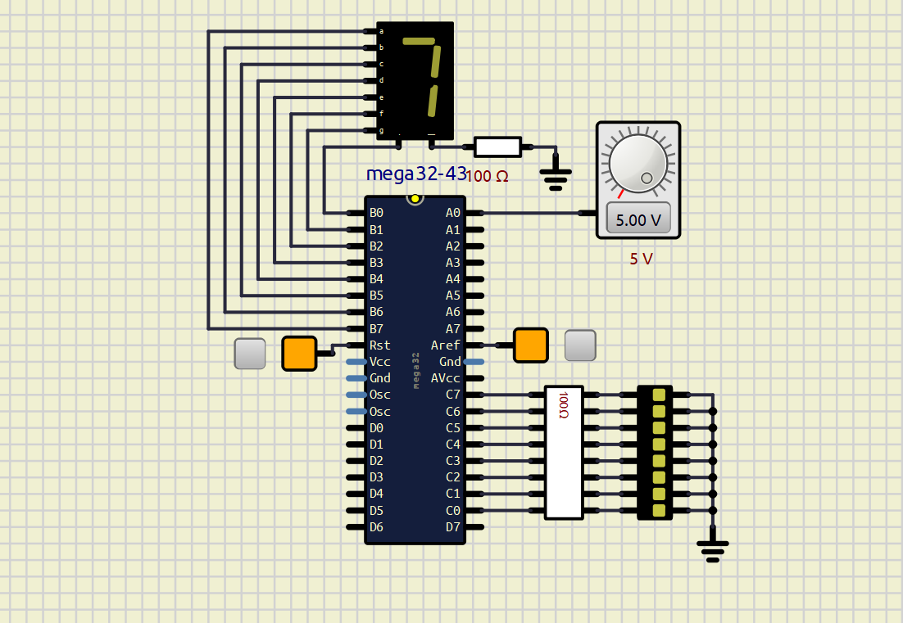

# ATmega32A ADC Interface and Display System

## Overview

This project demonstrates Analog-to-Digital Conversion (ADC) using the ATmega32A microcontroller programmed in AVR Assembly Language.

The system continuously reads an analog input signal through the ADC, displays the 8-bit converted value on LED bar graph, and shows the 3 most significant bits (MSBs) on a 7-segment display using a lookup table.

---

## Features

* AVR Assembly implementation
* ATmega32A ADC configuration
* Continuous analog signal sampling
* 8-bit ADC value display on LEDs
* 7-segment display visualization
* Lookup table-based digit decoding
* SimulIDE simulation

---

## Hardware Components

* ATmega32A Microcontroller
* Potentiometer (Analog Input)
* LED bar graph
* Seven-Segment Display
* Connecting Wires

---

## Project Structure

```text
code/
 └── main.asm

simulation/
 └── ADC.sim1

images/
 └── ADC.png
```

---

## Working Principle

1. The ADC is configured in 8-bit left-adjusted mode.
2. An analog voltage is applied to PA0 of the ATmega32A microcontroller.
3. The ADC converts the analog voltage into a digital value.
4. The converted value is displayed through the LED bar graph connected to PORTC.
5. The three most significant bits are extracted.
6. A lookup table converts the value into a 7-segment pattern.
7. The corresponding digit is displayed on the 7-segment display connected to PORTB.

---

## Circuit Diagram



---

## Building the Project

1. Open the AVR Assembly source file:

   ```text
   code/main.asm
   ```

2. Assemble the program using an AVR assembler such as Microchip Studio (recommended).

3. Load the generated HEX file into the ATmega32A microcontroller in SimulIDE before running the simulation.

## Running the Simulation

### Prerequisites

- SimulIDE installed on your system

### Steps

1. Open the simulation file in SimulIDE:

   ```text
   simulation/ADC.sim1
   ```
   
2. If the microcontroller does not already contain the program:

   - Double-click the ATmega32A microcontroller in SimulIDE.
   - Locate the **Load firmware** field.
   - Load the generated HEX file into the microcontroller.

3. Run the simulation.

4. Adjust the potentiometer connected to PA0.

5. Observe:

   * The digital ADC output on the LED bar graph.
   * The corresponding value displayed on the 7-segment display.

---

## Source Code

The AVR Assembly source code is available in:

```text
code/main.asm
```

## Author

Ankita Mandal
This project is licensed under the MIT License.

